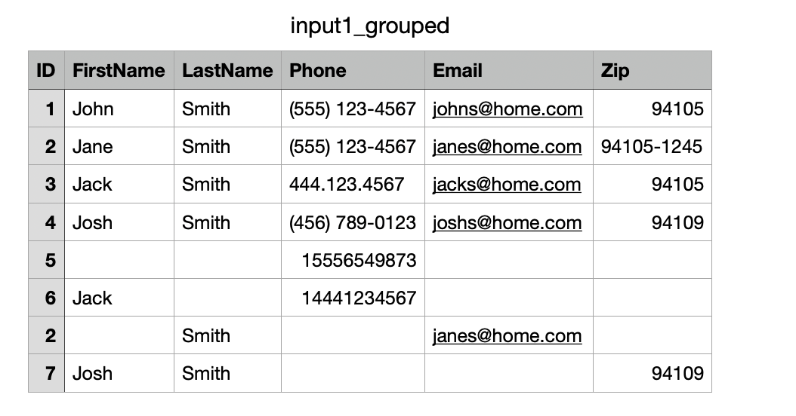

# Grouping service
`grouping-service` is a command line application that given a CSV file, matches rows based on a provided matching type.

Currently, there are three matching algorithms implemented: matching by email, by phone, or by email or phone.

## High level program flow

- Entry point: `bin/group_people.rb` is the command line interfaces, constructs and orchestrates csv handler class and main grouping service
- CSV rows are individually parsed into `Record` model, where input is normalized and validated
- Input matching type determines a concrete `strategy` used to group rows together
- Each `strategy` uses the [Union-Find](https://en.wikipedia.org/wiki/Disjoint-set_data_structure) data structure to assist with maintaining groups
- Groups are assigned an ID
- An output CSV is written, original data prepended with an `ID` column marking all records that *may* represent the same person



## Potential improvements
Productionizing - features & security
- Enhance field validations to guard against code injection
- More sophisticated way of maintaining person IDs than integer increment (e.g. UUID)
- Add model to track statistics on rows processed, number of validation errors raised, etc.
  - Potential for logging validation errors
- Better user experience in CLI:
  - Progress bar when large files are processed
  - Running with verbose mode

Code level improvements
- Decouple CLI code from orchestrating the CSV handler and main grouping service
- Decoupling unit tests from rest of the program flow

Optimizations
- Explore speeding up & benchmarking Union-find algorithm (for example, by rank/weighting), runs on large files can take > 3 minutes
- Processing records in batches

Productionizing - testing
- Add integration tests
- Adding CI

## Getting Started

### Installation

1. Clone the repository

2. Install dependencies
  ```bash
  bundle install
  ```

### Usage
Outputs of the program will be saved to /outputs. There are example input files under `spec/fixtures`
  ```bash
  Usage: bin/group_people.rb [options] <file_path> <matching_strategy_name>

  Available strategies:
    - email            : Match records with the same email address
    - phone           : Match records with the same phone number
    - email_or_phone  : Match records sharing either email or phone

  Example:
    bin/group_people.rb input.csv email_or_phone
  ```

### Running Tests
  `rspec`